  

 

  <!-- Primary Professional Links -->
  
  
  
  

   

  <!-- Social Media Links -->
  
  
  
  
  

   

  
  
  
  
  

 

<!-- Dynamic Typing Animation -->
<h1 align="center">
  
</h1>

<!-- Profile Statistics -->

  
  
  

  
  
  

---

## 👨‍💻 About Me

I'm **Suprio Pramanik** — a **Web Developer, UI/UX & Graphic Designer** from **Dhaka, Bangladesh**, turning ideas into clean, responsive, client-ready websites and visuals.

My foundation is **frontend engineering** — HTML, CSS, JavaScript and React — backed by **PHP/MySQL and Node.js** on the server and a designer's eye trained in **Photoshop, Illustrator, Figma and Canva**. Since 2020 I've been freelancing full-time on **Fiverr and Upwork**, shipping **40+ projects** for clients across **5+ companies** — from e-commerce stores to agency sites, portfolios and custom WordPress builds. **Diploma in Computer Technology**, Cox's Bazar Polytechnic Institute (2018–2023) · **Web Development Intern (PHP)**, Atova Technology (2022–2023).

**🎯 Current Mission:**

- 💻 Building **responsive, pixel-perfect websites** with React & WordPress
- 🎨 Designing **UI/UX interfaces & brand graphics** that convert
- 🛒 Shipping **e-commerce experiences** end to end
- 📈 Sharpening **JavaScript, React** & modern backend architecture

**🔗 Explore My Work:** **[supriopramanik.github.io/portfolio](https://supriopramanik.github.io/portfolio/)**

---

## 🛠️ Tech Stack

### Frontend Development 🎨

### Backend Development ⚙️

### Design Tools 🖌️

### CMS, Cloud & Hosting ☁️

### Tools & Platforms 🔧

---

## 💼 What I Deliver

  

---

## 📊 GitHub Activity

<!-- Fully self-hosted telemetry: generated by scripts/generate-telemetry.mjs
     and refreshed nightly by .github/workflows/update-telemetry.yml.
     No third-party widget services — nothing here can break. -->

  

  

  Self-hosted telemetry — rebuilt nightly by a <a href="./.github/workflows/update-telemetry.yml">GitHub Action</a> from live data. No third-party widgets, nothing to break.

---

## 🏢 Client Work

  

  
Client-facing builds live in a dedicated account — portfolio sites, company sites, e-commerce stores, quiz &amp; survey apps, agency websites and more.

---

## 🎯 Mission Parameters

- 🛰️ **Primary directive** — turn client ideas into **clean, fast, conversion-ready websites**
- 🎨 **Design protocol** — every build starts in **Figma**, ends **pixel-perfect** on every screen
- 🤝 **Alliances** — open to **freelance clients, agencies & full-time teams** (**remote-first** 🌍, flexible)
- ⚡ **Rules of engagement** — fast communication, honest timelines, **unlimited revisions**
- 📈 **Growth loop** — every project compounds: frontend foundation → design edge → backend depth

---

## 📬 Let's Connect!

  <h3>🚀 Open to Freelance Projects & Full-Time Opportunities</h3>

  

    I'm actively taking on projects where I can build meaningful products, 
    collaborate with great clients and teams, and keep growing as a developer & designer.
  

   

  <table>
  <tr>
    <td align="center">
      
    </td>
    <td align="center">
      
    </td>
    <td align="center">
      
    </td>
  </tr>
  <tr>
    <td align="center">
      
    </td>
    <td align="center">
      
    </td>
    <td align="center">
      
    </td>
  </tr>
  </table>

   

  

    <b>📍 Location:</b> Dhaka, Bangladesh 
    <b>💼 Status:</b> Open to Freelance & Full-Time 
    <b>🌍 Preference:</b> Remote-First | Flexible 
    <b>⚡ Response Time:</b> Fast & Professional
  

---

## 💰 Support My Work

  

---

  

   

  

    
  

  

    <i>⭐ Star my repositories if you find them helpful!</i>
  

  

    <b>💙 Built with passion by <a href="https://supriopramanik.github.io/portfolio/" target="_blank" rel="noopener noreferrer">Suprio Pramanik</a></b>
  

  Diploma in Computer Technology | Cox's Bazar Polytechnic Institute (2018–2023)

